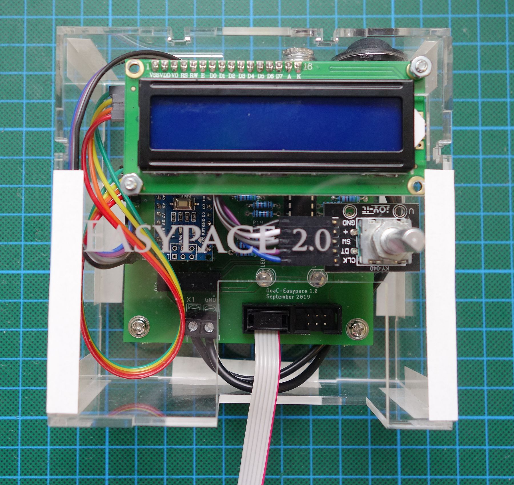

# Easypace
Open source biphasic pulse generator for electrical stimulation of tissues
developed by Oliver Schneider at the µOrganoLab & Fraunhofer Institute for Interfacial Engineering and Biotechnology (IGB)

https://github.com/loslab/easypace

Easypace was originally built for pacing cardiac tissues in microfluidic Organ-on-Chip systems, however it can be certainly used
for other purposes. It generates adjustable biphasic pulses with frequencies of ~ 0.1-10 Hz, 
amplitudes of up to ~ 12.5 V and pulsewidths of ~ 1 - 200 ms.
Generally it can also be just an idea/ starting point for your own improved pacer :rocket:.

---
### Features 

* 2 independently controllable pulseforms, 4 outputs in total
* Arduino-based, beginner-friendly assembly, hand-solderable
* manual control as well as scriptable remote control
* fairly cheap (cost of all parts < 100 €)

### Instructions
Check out the [wiki](https://github.com/loslab/easypace/wiki) for assembly & usage instructions

### Problems, questions, bugs, feedback and suggestions
I'm not a trained electrial engineer, so don't expect a professional build. I tinkered around with Easypace during my phd studies to build a cheap, 
scaleable system for pacing multiple tissues in cardiac Organ-on-Chip systems which I could adjust to my needs and control remotely.
We are happy about any feedback on Easypace. Just tell us if you have any improvement ideas and open a pull request or get in touch via ghilorevilo@posteo.de.

### License
Please cite Easypace if it helps you in your research.

This project is licensed under a BSD 3-Clause license. See the [LICENSE](LICENSE) file for details.